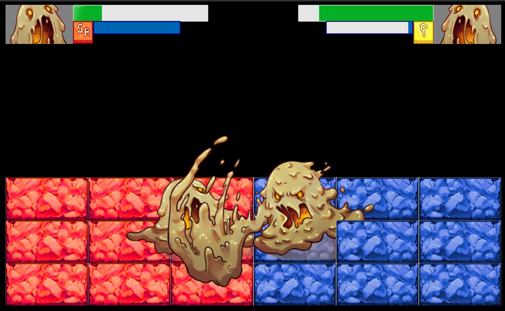

#  Project #1: Dream Field

Under construction, please be patient...

# 1. Introduction
Dream Field is grid-based two player game, where the goal is to defeat the other player through.

# 2. Game Elements
## 1. Aesthetics
## 2. Mechanics
## 3. Technology
## 4. Story

# 3. Instructions
## Controls
## How to Play

# 4. Development
## How it came to be
## Facilitating Movement
## Facilitating Attacks
### Long Range
### Short Range (Special)
### Sketches and Wireframes

# 5. Future

# 6. Bugs and Errors

# 7. Credit
