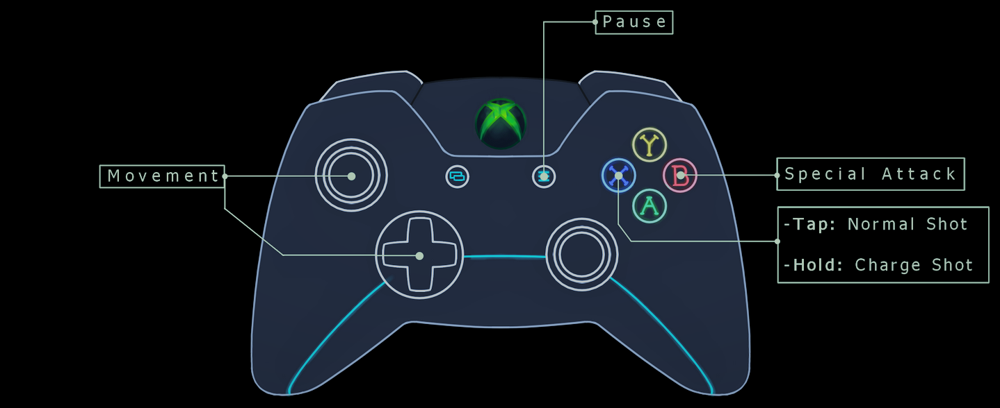

#   Dream Field
## Introduction
Dream Field is a grid-based two-player competitive game. I developed the game as my first project for the [Software Engineering Immersive course](https://generalassemb.ly/education/software-engineering-immersive-remote), specifically for the Front-End Development unit.

If you have two controllers, You can play Dream Field by clicking <a href="https://jaalsadev.github.io/Dream-Field/" target="_blank">here</a>, if not, click on the GIF below to watch a video.

[](https://www.youtube.com/watch?v=cC_-I8DO8Rk "Click here to watch a video!")


## Table of Contents
- [Instructions](#Instructions)
- [Theme and Game Elements](#Theme-and-Game-Elements)
- [Development](#Development)
- [Roadmap](#Roadmap)
- [Bugs and Errors](#Bugs-and-Errors)
- [Team](#Team)

## Instructions
<p align="center">

</p>

The game requires two gamepads to work. Make sure to press any button If a controller is connected, and the browser hasn't detected it yet.

I had only tested the Gamepad API with an Xbox One controller, and I'm unsure if other controllers will work. If you have a different controller and it doesn't work, let me know.

The game will pause if a controller is disconnected, and an overlay message will appear, providing the appropriate instructions.


## Theme and Game Elements
Dream Field (as the name suggests) is about dreams. Dreams are a source of infinite inspiration and creativity. Their nature can vary; they range from ordinary to surreal; they can be exciting, frightening, magical, adventurous, phantasmagoric. 

With Dream Field, I want to deliver an experience that is phantasmagoric, psychedelic, and leans towards surrealism. To provide such an experience, I broke the game down into its most essential elements by utilizing the Elemental Tetrad, a framework that the author of [The Art of Game Design](https://www.amazon.com/Art-Game-Design-Lenses-Third/dp/1138632058), Jesse Schell, devised. The Elemental Tetrad decomposes games into four essential elements: Aesthetics, Mechanics, Technology, and Story. These elements must work together to support and reinforce the game's theme as much as possible.

<p align="center">
    
</p>


### 1. Aesthetics
*Aesthetics* describe the look, sound, and feel of a game.

For the time being, Dream Field contains visuals only, and one sound effect at the Title screen and Instructions screen. 

Dream Field leans towards a cartoonish and simplified art style that gives off a pleasant impression to players. There is high contrast between the saturated hard-edged tiles and the character's soft-edged desaturated color. The icons that represent special attacks consist of pixelated blocks, with every color representing a specific attack.

We do not own the sound effect that plays at the title screen; it comes from [Mega Man X6](https://en.wikipedia.org/wiki/Mega_Man_X6), a Capcom game that came out in 2001.


### 2. Mechanics
*Mechanics* are the rules of a game. They describe how a player can and cannot achieve a goal.

A player can only win the game if they defeat the other player. Players can execute the following actions:
* **Attack**: Players can attack each other using long-range and short-range attacks.
* **Move**: Players can move on their assigned grid horizontally or vertically.

### 3. Technology
*Technology* refers to any materials, tools, and interactions that make the game possible, from paper and pencils to computer hardware.

I divided the technology used to make Dream Field into two types based on its utility: Design and implementation.

1. **Design**: 
 * **Pen and Paper**: Prototyping screens, game mechanics, and artwork.
 * [**Figma**](https://www.figma.com/): Prototyping screens.
 * [**Krita**](https://krita.org/en/): Artwork.
 * [**draw.io**](https://drawio-app.com/): UML diagrams.
 
2. **Implementation**:
 * **Javascript**: Game mechanics, controls, [Gamepad API](https://developer.mozilla.org/en-US/docs/Web/API/Gamepad_API/Using_the_Gamepad_API "Gamepad API").
 * [**jQuery**](https://jquery.com/ "**jQuery**"): Screen transitions, character frame transitions.
 * [**Parcel**](https://parceljs.org/): Web application bundler.
 * **CSS**: Styling.
 * **HTML**: Website structure.

### 4. Story
*Story* is the sequence of events that unfolds in a game.

Currently, Dream Field has no story, but we are strongly considering making one for it.


## Development
### Inspiration
The idea came to me while I was driving back home from Effat University, where I had finished attending a Software Engineering class. I did not know what kind of game I wanted to develop, especially since I wanted to limit the implementation technology to what I had learned at the time (HTML, CSS, JS) and maybe use the gamepad API. I thought to myself, "What can I do with the grid and flex layouts? They're too basic!". 

The word "grid" kept repeating in my mind, and then suddenly, I remembered a game series that I used to play as a kid; it used grids in the battle section. The game series is Mega Man Battle Network. 
<p align="center">
    
</p>
Developing a game like Battle Network should be fun and enough of a challenge. I can mimic the battle section by creating two different colored panels (Red and Blue), and out of the panels, I can create two colored grids using CSS Grid; after that, I can create the whole battlefield by applying the flexbox layout on the two grids.
### Creating Dreamfield (battlefield) 
Dreamfield is a battlefield that consists of two distinctly colored grids. Each grid consists of nine panels organized in a 3x3 fashion. A panel is a platform on which, at most, one object (such as a character) can stand on.


I created Dreamfield by using a div with the class "Dreamfield"
```HTML 
<div class="Dreamfield"></div>
```
The Dreamfield div has two divs with the class "grid" nested in it, grid-1 and grid-2.
```HTML 
<div class="grid" id="grid-1"></div>
<div class="grid" id="grid-2"></div>
```

Each grid div has nine divs with the class "panel". The panel divs' ids are numbered from 1 to 9.

```HTML 
<div class="panel" id="1"></div>
<div class="panel" id="2"></div>
                .
                .
                .
<div class="panel" id="9"></div>
```

Of course, without any styling, Dreamfield will look like a long column of panels. I added a rule for the Dreamfield div to place the grid divs on a row and place them at the center of the screen, and then I added a rule for both grids to place the panels in a 3x3 grid layout.

```CSS
.Dreamfield {
    display: flex;
    justify-content: center;
}

.grid {
    display: grid;
    grid-template-columns: repeat(3, 1fr);
    grid-template-rows: repeat(3, 1fr);
}
```

To utilize Dreamfield for gameplay purposes, I created a Grid class that stores a reference to all the panels of a grid in a 2D array. The Grid class requires an ID to fetch and store the panels of a specific grid.

```JavaScript
export default class Grid {
    constructor(ID) {
        this.ID = `grid-${ID}`;
        this.rows = [];
        let panels = $(`#grid-${ID}`).children();

        //Store a reference of each visual panel to its corresponding row and column
        for (let i = 0; i < 3; i++) {
            let row = [];

            for (let j = 0; j < 3; j++) {
                row.push(panels[3 * i + j]);
            }
            this.rows.push(row);
        }
    }
}
```
### Facilitating Player Actions
#### Facilitating Movement
#### Facilitating Attacks
##### Long Range
##### Short Range (Special)
## Roadmap
I have many ideas about the direction of Dream Field's development. Of course, this repository is nothing more than the SEI course's version of the game, and the final version will differ drastically from this version.

* Study game design and game development for the web.
* Continue development on a private repository.
* Overhaul the whole game to utilize HTML Canvas.
* Crystallise the game's theme by reading about various subjects (e.g., sleep, the mind, dreams).
* Provide the game's theme with focus by adding a story.
* Create more characters.
* Commission artists to create music, sound effects, and animations.
* Implement various game modes (single-player, multiplayer).
* Add more gameplay elements.
* Figure out a way to monetize or sell the game.

## Bugs and Errors
* Transition between character frames is delayed sometimes.

## Team
||||
| :---: | :---: | :---: |
|**Name** |Jaber Alsalamah|Ashraqat Alsalamah|
|**Role**|Programmer|Artist|
|**GitHub**|<a href="https://github.com/JaAlSaDev">JaAlSaDev</a>|<a href="https://github.com/Ninja-jumipy2011">Ninja-jumipy2011</a>|
|**Links**|<a href="https://twitter.com/JaAlSaDev">Twitter</a>|<a href="https://www.instagram.com/ninja_jumipy2011/">Instagram</a>|


